# eTicket

## ¿Qué es?

Es un sistema de tickets de soporte electrónico basado en PHP, que puede recibir tickets por correo electrónico (pop3 / pipe) o un formulario web. También ofrece un administrador de tickets con muchas funciones. Una solución de asistencia técnica ideal para cualquier sitio web.

### Principales características

- Admite alias / tuberías con perl gateway.

-  Admite el inicio de sesión POP3 con crontab opcional.

- Utiliza puerta de enlace Perl, backend PHP y base de datos MySQL.

- Maneja correos electrónicos ilimitados.

- Paneles de administrador / partidario / usuario.

- Intervalos de correo electrónico para evitar bucles de respuesta automática.

- Máximo permitido para limitar el número máximo de tickets que el usuario puede haber abierto.

- Filtros para eliminar mensajes en respuestas.

- Acepta archivos adjuntos y limita el tamaño.

### Funciones de administración

- Eliminar completamente los tickets de la base de datos.

- Crear categorías (departamentos).

- Crear representantes (partidarios).

- Definir grupos.

- Editar o deshabilitar mensajes de respuesta.

- Alertas por correo electrónico compatibles con buscapersonas.

- y mucho más...

### Funciones de usuario:

- Inicie sesión con correo electrónico y cualquier boleto que se le asigne.

- Ver todos los tickets enviados desde ese correo electrónico. 


### Guía de instalación/uso:

He descargado el **eTicket** en formato ZIP, lo he desplegado en el **xampp 3.2.4** y no ha funcionado porque la versión de PHP del XAMPP era la 7 eTicket requería la 5.

A continuación probé un método alternativo, usando una máquina virtual con XAMPP descargada con Vagrant, ejecutando los siguientes comandos desde el CMD en Windows:

```bash
mkdir xampp
cd xampp
vagrant init danielbueno99/xampp
vagrant up
```

Para conectar a la máquina virtual, una vez descargada e iniciada, lanzamos el siguiente comando:

```bash
vagrant ssh
```

Luego, para determinar la configuración de PHP, creamos el fichero `phpinfo.php` y lo abrimos desde un navegador:

```bash
vagrant@jessie:/var/www$ sudo nano phpinfo.php
```

Dentro del fichero introducimos lo siguiente:

```php
<?php
    phpinfo();
?>
```

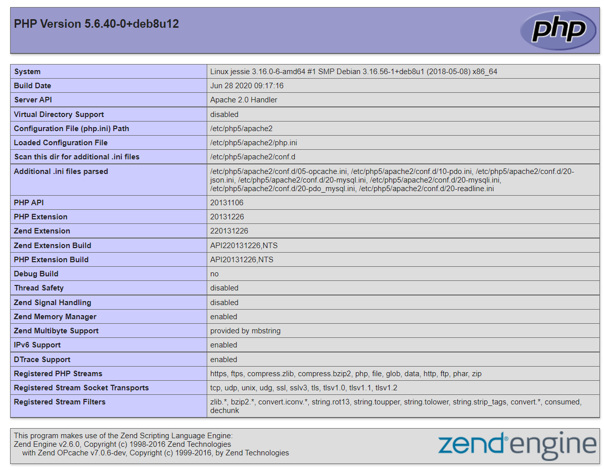

Luego hemos descargado eticket en formato zip:

```bash
root@jessie:/home/vagrant# wget https://eticketsupport.com/fe/wp-content/uploads/2016/05/eticket.zip
--2021-06-14 09:26:19--  https://eticketsupport.com/fe/wp-content/uploads/2016/05/eticket.zip
Resolving eticketsupport.com (eticketsupport.com)... 104.21.41.178, 172.67.149.21, 2606:4700:3030::6815:29b2, ...
Connecting to eticketsupport.com (eticketsupport.com)|104.21.41.178|:443... connected.
HTTP request sent, awaiting response... 200 OK
Length: 269893 (264K) [application/zip]
Saving to: ‘eticket.zip.1’

eticket.zip.1                 100%[===================================================>] 263.57K   406KB/s   in 0.6s

2021-06-14 09:26:20 (406 KB/s) - ‘eticket.zip.1’ saved [269893/269893]

root@jessie:/home/vagrant#
```

A continuación instalamos el comando  `unzip` para descomprimir eTicket:

```bash
apt install -y unzip
```

Se han actualizado los paquetes de la máquina e instalar los paquetes de php5 y mysql

```bash
apt update
apt install -y php5-mysql
```

Además de instalar los paquetes que han sido necesarios para que funcione también tenemos que poner los comandos para crear la base de datos en MySQL y ver las tablas de esta.

```sql
create database eticket;
show tables;
```


Y este es el **resultado después de instalar** eTicket en xampp, ahora nos quedarían estos pasos de instalación (los seguimos igual que las imágenes):


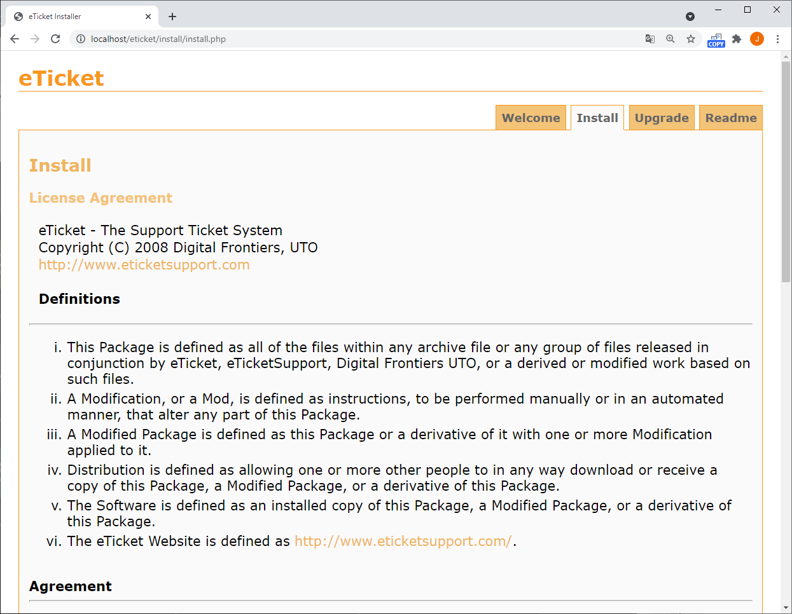

.PNG)

Aquí ponemos el nombre del servidor de la base de datos, el nombre de la base de datos, el usuario y la contraseña.


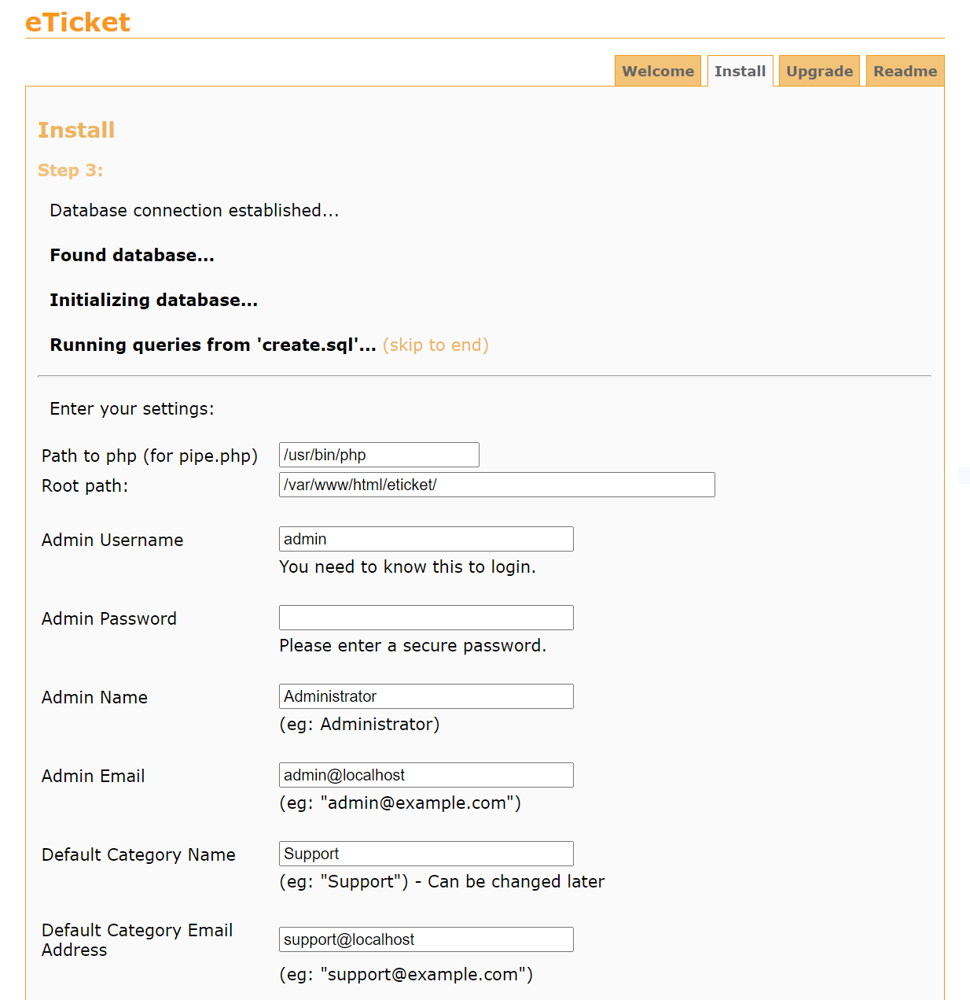

Lo dejamos tal cual, y si queremos modificamos el usuario admin y ponemos una contraseña.


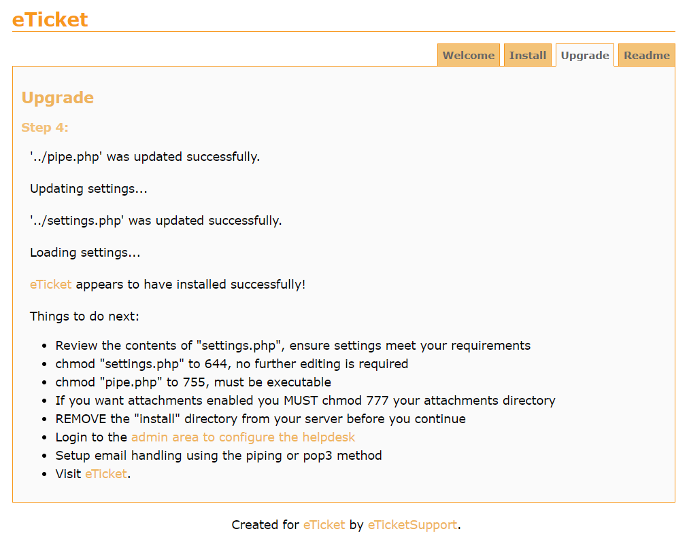


Luego en este paso tenemos que hacer lo que nos indica el anterior, en el apartado “Things to do next”. (Cosas para hacer a continuación)

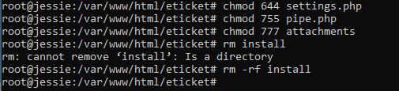


Una vez hemos terminado, iniciamos sesión con el usuario "admin" y la contraseña que hemos puesto, y ya tenemos acceso a este programa.

 


## Pantalla principal eTicket

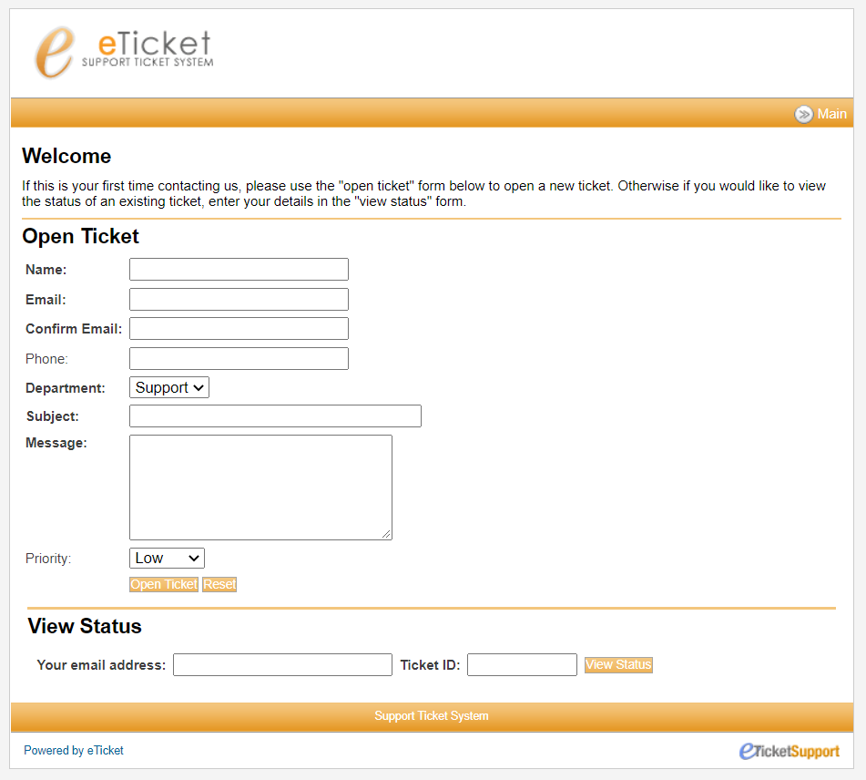


### ¿Cómo mandar un ticket?

Aquí rellenamos todos los datos que nos piden para poder mandar un ticket, hay que tener en cuenta el correo porque ahí es donde mandaran el ID del ticket. Una vez se ha rellenado se genera el ID, y con él puedes ver el estado de el ticket correspondiente.

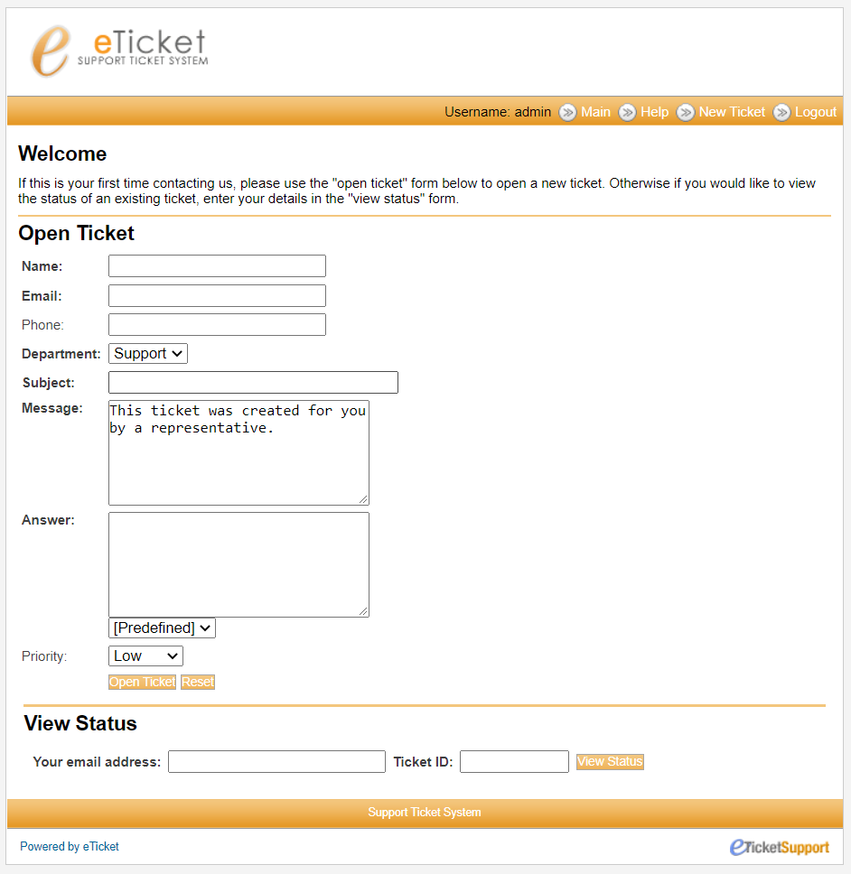


### ¿Cómo crear grupos de usuarios?

Para crear un grupo pues entramos con el usuario administrador ya que es el usuario que tiene estos permisos. Damos clic en `Add New` y ya nos aparecerán distintos campos en los cuales los seleccionaremos tal y como lo deseemos.

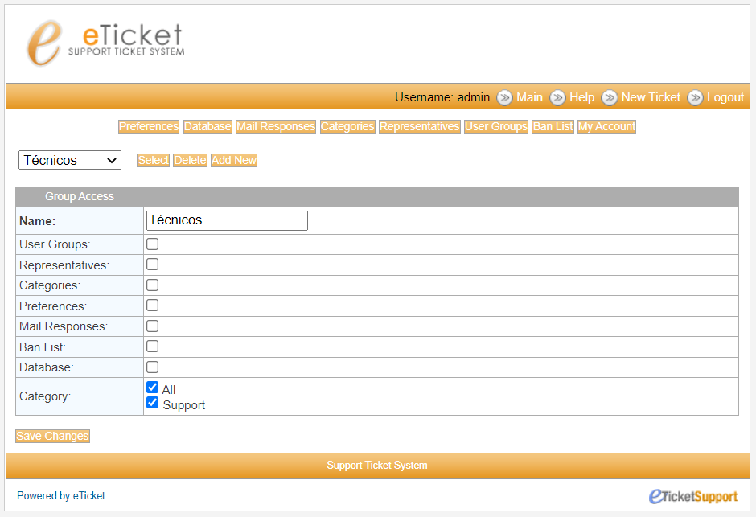


### ¿Cómo crear un usuario?

Una vez creado el grupo de técnicos, vamos al apartado de `Representative` y creamos un usuario dentro del grupo `Técnicos`.

Cuando se hayan puesto los datos en el apartado `Groups` le ponemos el grupo `Técnicos`.

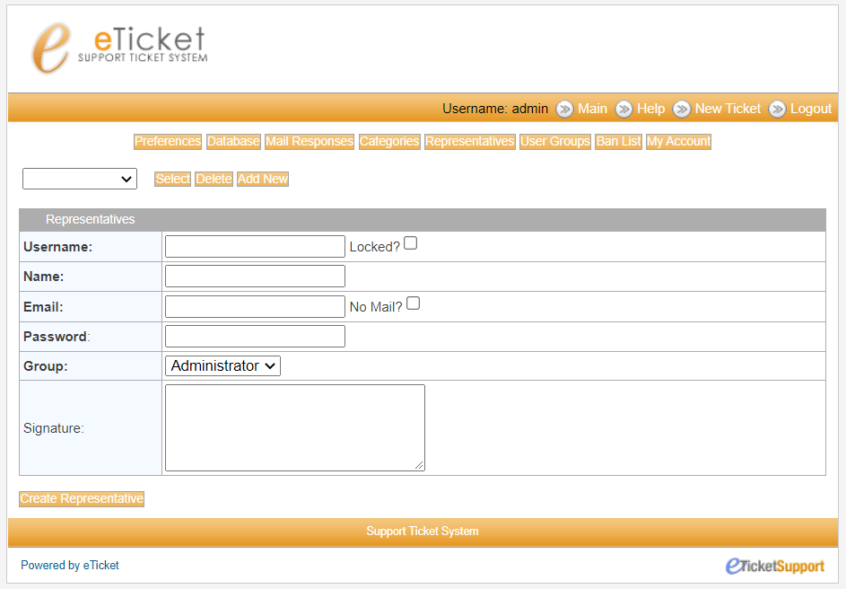


### ¿Cómo acceder con el nuevo usuario?

Para acceder ponemos en la url de nuestro navegador `localhost/admin.php` y nos aparecerá la siguiente ventana: 

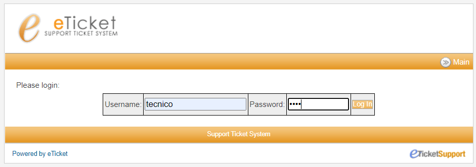

Y nos logeamos.

Ya logueado nos aparece esta ventana:

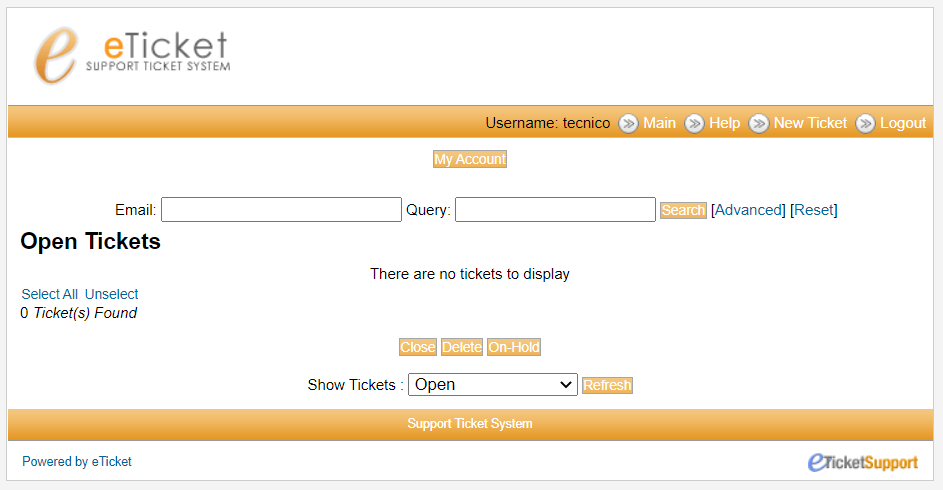


Podremos ver los tickets que están asignados a nuestro usuario, y si damos clic  en `New Ticket` crearemos uno nuevo.


## Referencias

- [eTicket](https://eticketsupport.com/about/) 

